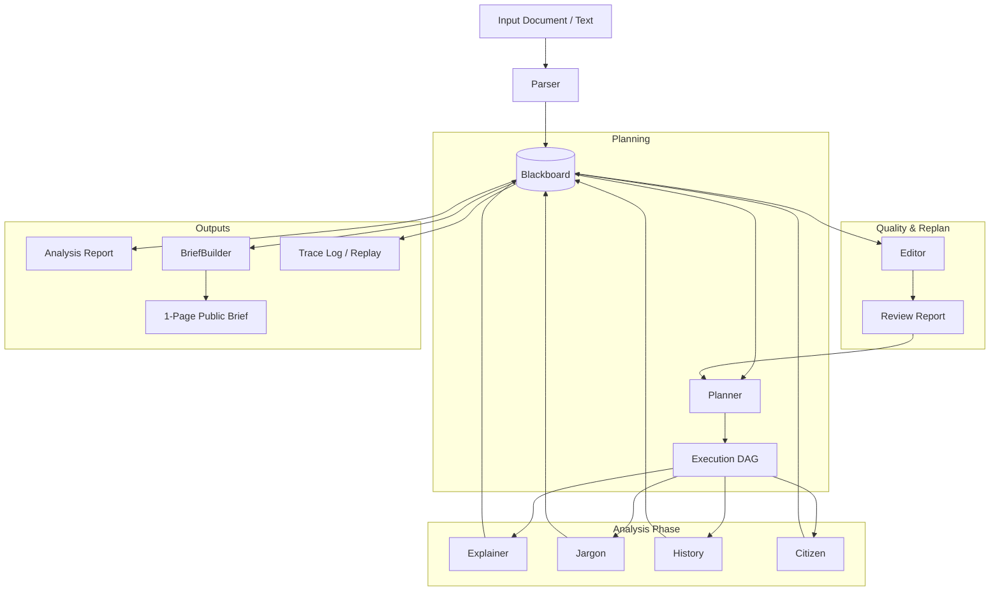
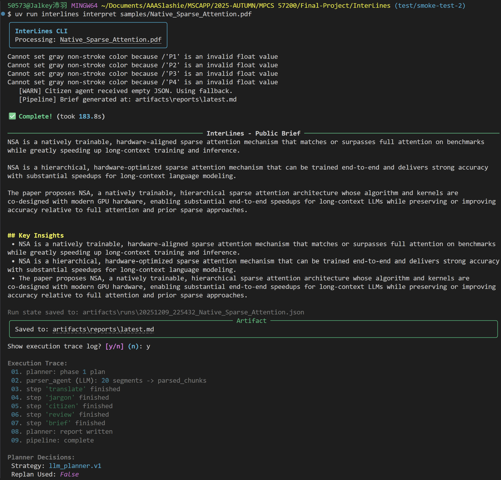

<div align="center">

# InterLines

### 🧠📐 The AI-native editorial pipeline  
### that **reads, thinks, verifies, and refines**

InterLines is a **traceable analysis engine** for research papers and policy documents.

It produces:
📊 **(1) a fully traceable analysis report**, and  
📰 **(2) a concise, public-facing one-page brief**,  
generated *from* the analysis layer rather than directly from the source text.

Built for transparency, auditability, and responsible synthesis —  
**not** opaque, single-pass text generation.

[](https://www.python.org/)
[](LICENSE)
[](https://github.com/astral-sh/ruff)
[](https://github.com/astral-sh/uv)

[📍 Positioning](#-positioning) •
[🧠 Design Philosophy](#-design-philosophy) •
[🔍 Current Scope](#-current-scope) •
[🏗 Architecture](#-architecture) •
[🚀 Quick Start](#-quick-start) •
[🧭 Roadmap](#-roadmap)

</div>


## 📍 Positioning

InterLines is **not** a generic chatbot or a prompt-based writing tool.

It is an **AI-native editorial and analysis pipeline** designed to:
- decompose complex documents,
- reason over them in structured stages,
- surface uncertainty and provenance, and
- synthesize clear public communication from auditable analysis.

The system deliberately separates two layers:

### 🔎 1. Analysis Layer (full fidelity)

- Structured analytical artifacts
- Planner decisions and dependency graphs
- Quality signals and editor feedback
- Execution traces and replayable runs

### 📰 2. Communication Layer (1-Page Public Brief)

- Compact, accessible synthesis
- Generated *from* the analysis layer
- Optimized for clarity, not exhaustiveness

This separation allows InterLines to serve both:
- **analysts, reviewers, and auditors** who require transparency, and
- **general readers** who only need a clear explanation.


## 🧠 Design Philosophy

Why build a structured, multi-agent editorial system instead of a single powerful prompt?

InterLines is designed around several first-principle constraints of current LLM systems.


### 1. The “Context Amnesia” Problem

Single-pass LLM calls often struggle with long-context coherence (64k+ tokens and beyond).
Important details may be forgotten, overwritten, or hallucinated as generation progresses.
The model may see every tree, but lose the forest.

**InterLines Solution — Blackboard Architecture**

InterLines adopts a **Blackboard Architecture**, where agents operate on scoped tasks
and write structured artifacts into a shared memory state.

- The **Parser** segments and anchors the source material.
- The **Explainer** focuses on technical arguments and internal logic.
- The **Historian** tracks background, timeline, and contextual information.

By externalizing memory into structured artifacts, InterLines reduces context loss
and avoids relying on a single, fragile prompt window.


### 2. The “Jack of All Trades” Fallacy

Asking one model to simultaneously act as a scholar, a journalist, and an editor
often produces muddled tone, inconsistent depth, and unclear intent.

**InterLines Solution — Role Specialization**

InterLines enforces explicit role boundaries:

- The **Explainer** performs deep technical reasoning.
- The **Citizen Agent** translates concepts for non-expert readers.
- The **Planner** acts as an *Editor-in-Chief*, dynamically routing tasks
  and coordinating execution based on document type and quality signals.

This separation reduces role interference and allows each agent to optimize
for a single cognitive objective.


### 3. From “Black Box” to “Glass Box”

Most chatbots provide an answer, but hide the process that produced it.
This makes inspection, debugging, and trust calibration difficult.

**InterLines Solution — Flight Recorder Traces**

Every intermediate artifact, decision, revision, and score is serialized
into a **Trace Log**.

Runs can be replayed offline, inspected step-by-step, and audited after the fact.
The system exposes *how* a conclusion was formed, not just *what* was generated.

InterLines is designed as a **glass-box system**, not a black box.


## 🔍 Current Scope

### ✅ What InterLines does today

- Parses and segments long documents into structured chunks.
- Executes role-scoped analytical agents  
  *(planner, explainer, jargon, history, citizen, editor)*.
- Orchestrates execution via an explicit **planner DAG**.
- Maintains a shared **blackboard state** across all stages.
- Runs an editor-driven refinement loop  
  *(editor feedback → optional replanning)*.
- Produces typed, schema-backed analytical artifacts.
- Generates Markdown outputs for both analysis and public briefs.
- Saves full execution traces for inspection, replay, and debugging.

> 🧩 **Clarification**  
> Agents are currently **role-scoped analytical modules**,  
> not autonomous, tool-using entities.


### 🚧 What InterLines does **not** fully do yet

- No unified **skill registry** for reusable capabilities.
- No general **tool router** for dynamic tool invocation.
- No built-in online **retrieval or verification** loop by default.
- No full **MCP-style** context / tool protocol layer yet.

These are **explicit design boundaries**, not hidden limitations.


## 🏗 Architecture

InterLines follows a:

**Planner → Agent Pipeline → Blackboard → Synthesis**

architecture.



### 🧪 Planned Capability Layer

```text
Agent Decision → Skill → Tool → Verified Artifact
```

Planned skills include:

* 🔍 `SearchSkill`
* ✅ `VerifySkill`
* ✂️ `ExtractSkill`


## 🗂 Project Structure

```plaintext
INTERLINES/
├── artifacts/                  # generated reports and run traces
├── docs/                       # architecture, contracts, roadmap
├── examples/                   # sample briefs and traces
├── schemas/                    # JSON schemas for contracts
├── src/interlines/
│   ├── agents/                 # planner / explainer / editor / brief builder
│   ├── api/                    # FastAPI app, async job management
│   ├── core/
│   │   ├── blackboard/         # memory + trace storage
│   │   ├── contracts/          # Pydantic artifact schemas
│   │   ├── planner/            # DAG planning logic
│   │   └── evals/              # evaluation utilities
│   ├── llm/                    # model registry and client abstraction
│   └── pipelines/              # orchestration entrypoints
├── tests/
├── pyproject.toml
└── uv.lock
```


## 🚀 Quick Start

### 🔧 Prerequisites

* Python 3.11+
* `uv` (recommended)
* At least one provider API key
  *(OpenAI / Google / DeepSeek / etc.)*


### 📦 Installation

```bash
git clone https://github.com/your-username/interlines.git
cd interlines
uv sync
cp .env.example .env
```

Fill `.env` with the provider keys you plan to use.


### 🖥 CLI

```bash
uv run interlines interpret samples/Native_Sparse_Attention.pdf
```

Replay a saved trace:

```bash
uv run interlines replay artifacts/runs/<run-file>.json
```

### Demo


### 🌐 API

```bash
uv run uvicorn interlines.api.server:app --reload
```

Endpoints:

* 📖 Swagger UI: `http://localhost:8000/docs`
* ➕ `POST /interpret`
* ⏱ `GET /jobs/{job_id}`
* ❤️ `GET /health`

## 📂 Included Examples

InterLines comes with two fully processed examples — a technical paper and a public policy plan — so you can explore the outputs without running the pipeline yourself.

### 📝 Sample Public Briefs (Markdown)

- [Americas AI Action Plan](examples/briefs/Americas%20AI%20Action%20Plan.md)  
  *A public-policy oriented brief summarizing the strategic goals and implications of the Americas AI Action Plan.*

- [Natively Sparse Attention](examples/briefs/Natively%20Sparse%20Attention.md)  
  *A technical brief explaining NSA, a hierarchical sparse attention mechanism for LLMs.*

You can view these directly on GitHub or download them as Markdown/PDF.

### 📜 Execution Traces (JSON)

Each run also includes a full trace containing planner decisions, agent outputs, and intermediate artifacts:

- [Trace: Native Sparse Attention](examples/trace/20251209_225432_Native_Sparse_Attention.json)
- [Trace: Americas AI Action Plan](examples/trace/20251209_230043_Americas-AI-Action-Plan.json)

These trace files are useful for:

- Debugging agent behavior  
- Understanding planner decisions  
- Research on multi-agent interpretability  
- Reproducing full execution states  

### 📜 Execution Traces (for debugging & research)

For each brief, InterLines also stores a full trace of the multi-agent run:

- `examples/trace/20251209_225432_Native_Sparse_Attention.json`
- `examples/trace/20251209_230043_Americas-AI-Action-Plan.json`

Each trace JSON contains:

- Planner decisions (strategy, phases, re-plans)
- All intermediate cards (Explanation, Jargon, Citizen, History, Review)
- Timing information and model metadata

These traces are useful if you want to:

- Inspect how the system arrived at a particular explanation
- Compare different prompt/model settings
- Build evaluation pipelines or research on multi-agent LLM systems

## 🧭 Roadmap

### ✅ Completed Foundations

* **M5** — Editor-driven refinement loop
* **M6** — Trace replay, CLI, and API baseline

### 🚧 Next

* **M7 — Analysis Report v1 + 1-Page Brief Synthesis**
  - Define a stable, schema-backed `analysis_report.v1` contract.
  - Clearly separate analysis artifacts from public-facing outputs.
  - Formalize the transformation pipeline from report → brief.
  - Establish baseline quality signals (completeness, coverage, uncertainty flags).

* **M8 — Skill / Tool Capability Layer**
  - Introduce a first-class `Skill` abstraction with explicit input/output contracts.
  - Add initial tool-backed skills (e.g., search, extraction, verification).
  - Log all skill invocations as traceable, replayable artifacts.
  - Preserve existing blackboard + planner semantics.

* **M9 — MCP-lite Protocol**
  - Define explicit context boundaries between agents, skills, and tools.
  - Standardize structured state passing (no implicit prompt coupling).
  - Specify a minimal tool invocation and logging protocol.
  - Focus on auditability and reproducibility over full autonomy.

* **M10 — Human-in-the-Loop Interface**
  - Build a lightweight inspection UI for runs, traces, and artifacts.
  - Enable human review, annotation, and approval of analysis outputs.
  - Support guided re-runs with partial overrides.
  - Treat human feedback as a first-class artifact in the trace.


## 🤝 Contributing

Contributions are welcome.
Please read `docs/CONTRIBUTING.md` before opening a PR.


## 📜 License

Distributed under the **Apache License 2.0**.  
See `LICENSE` for details.

